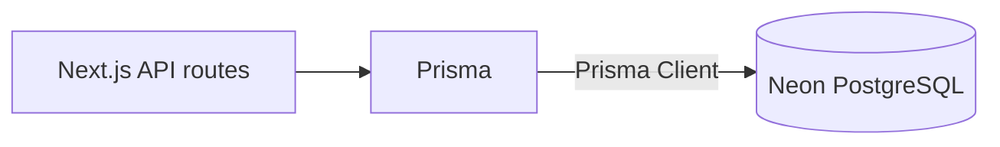

# Database Overview

The application stores all persistent state in **PostgreSQL** and interacts with it exclusively through [Prisma](https://www.prisma.io/). The authoritative definition of every table, column, index, and relation lives in [`prisma/schema.prisma`](../prisma/schema.prisma); consult that file whenever you need precise details or to introduce schema changes.

## High-level architecture

- **Prisma Client** is generated from the schema and used in API routes, background jobs, and tests to run typed database queries.
- **Neon** hosts the managed PostgreSQL instance for staging and production environments. Local development can target either Neon (shared dev branch) or a Docker/Postgres instance via the `DATABASE_URL`.
- **Connection strings** follow the standard PostgreSQL format and are injected via environment variables (`DATABASE_URL`, `SHADOW_DATABASE_URL` for migrations).

## Core domain models

The data model centers on a few core entities:

- `User` — primary identity with OAuth account and session records managed by NextAuth. Cascading relations ensure dependent data is cleaned up automatically.
- `Thread` — conversation container scoped to a single user. Threads track the active model and the active scopes applied to that conversation.
- `Message` — ordered transcript entries associated with a thread and tagged with provider/model metadata and optional usage payloads.
- `ScopeConsent` — records per-thread consent decisions for sensitive scopes to satisfy privacy requirements.

Refer to the schema file for additional authentication helper tables (`Account`, `Session`, `VerificationToken`) and indexes that support application workflows.

## Scope data storage

Scopes are defined in [`lib/scopes.ts`](../lib/scopes.ts) and surfaced through the API contract documented in [`docs/API.md`](./API.md). The database persists scope state in two places:

- `Thread.activeScopeKeys` stores the current set of scopes (as a PostgreSQL text array) that should be applied when the user interacts with the thread.
- `ScopeConsent` tracks when a user grants or revokes consent for each scope within a thread, enabling auditing and compliance checks.
- `Message.metaJson` can capture attribution data such as which scopes were consulted when generating a response.

These structures keep the runtime scope registry in sync with persisted consent history without duplicating scope metadata in the database.

## Working with migrations

Prisma migrations are the source of truth for schema evolution:

- Run `npx prisma migrate dev` during development to create new migrations and apply them to your local database (or dev Neon branch).
- Deploy schema changes with `npx prisma migrate deploy` in production environments targeting Neon.
- Use `npx prisma db push` only for bootstrapping disposable environments where you do not need to generate migration files.

Before shipping schema updates, inspect the generated SQL to ensure compatibility with Neon’s managed PostgreSQL features (branching, connection limits, storage quotas). Keep the schema file as the canonical reference and update this document only when workflows or high-level architecture change.
